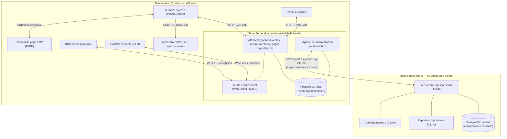
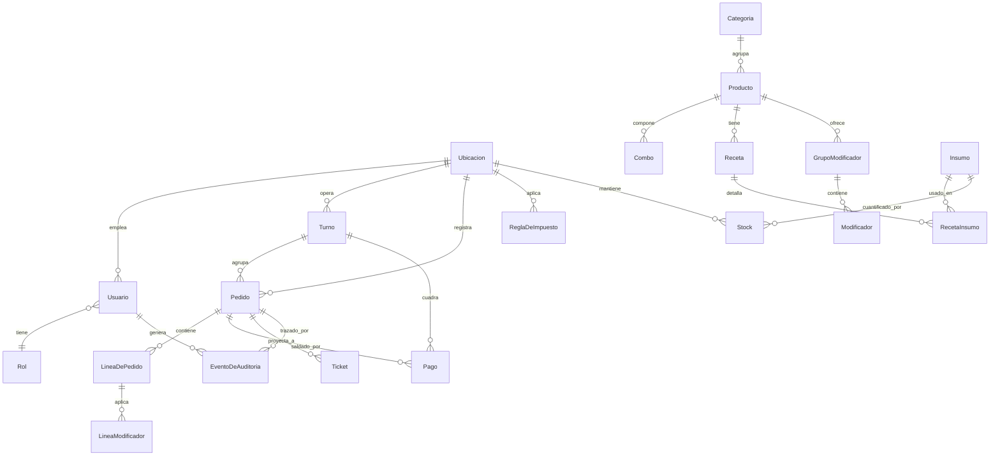

# Arquitectura técnica — Sistema POS de Chicken Kitchen (Digenius)

- **Proyecto:** Sistema POS de Chicken Kitchen (Digenius)
- **Fase:** 1 — Arquitectura
- **Documento:** Arquitectura técnica de referencia + contrato compartido para Fase 2
- **Autor:** `arquitecto-pos`
- **Fecha:** 2026-07-10
- **Estado:** Borrador para revisión
- **Insumos:** `docs/requisitos.md` (Fase 0, LISTO), `README.md`

> Este documento es el **contrato compartido** de la Fase 2. Todos los módulos
> (`backend-ventas-pos`, `menu-inventario-pos`, `pagos-pos`, `kds-cocina-pos`,
> `frontend-mostrador-kiosco-pos`) DEBEN respetar los nombres de entidades, los
> contratos de API/eventos y las restricciones aquí definidas. Toda decisión
> relevante está registrada como ADR en `docs/adr/`.

---

## 1. Principios rectores (derivados de requisitos)

1. **Offline-first no negociable** (RNF-02, RNF-06): la tienda vende, cocina y cobra
   en efectivo aunque la nube o el internet estén caídos. La **fuente de verdad
   operativa vive en la tienda**, no en la nube. Ver ADR-0002 y ADR-0004.
2. **Velocidad en hora pico primero** (RNF-01): agregar ítem <300 ms, KDS ≤2 s.
   Todo lo del camino crítico (tomar pedido, enviar a cocina, cobrar) se resuelve
   dentro de la LAN de la tienda, sin dependencia de red externa.
3. **Diseñar para multi-tienda sin sobre-construir el MVP** (S-01, S-08): el modelo
   de datos y la topología contemplan `Ubicacion` e impuestos por ubicación desde
   el día 1, pero la consola central multi-tienda se difiere. Ver ADR-0001.
4. **El POS nunca toca datos de tarjeta** (RNF-04): PAN/CVV se delegan al
   terminal/PSP con P2PE y tokenización. El POS maneja **tokens y resultados**, no
   números de tarjeta. Ver ADR-0005.
5. **Auditoría inmutable de acciones sensibles** (RNF-07): eventos append-only.
6. **Degradación controlada** (RNF-06): la caída de un periférico o de la nube
   reduce funciones, no detiene la venta.

---

## 2. Vista general del sistema y topología

Arquitectura **híbrida hub-and-spoke** (ADR-0001):

- **Hub (nube central):** respaldo, consolidación multi-tienda, catálogo maestro
  futuro, reportes corporativos. **No está en el camino crítico de venta.**
- **Spoke (nodo de tienda / Store Server):** un servidor local por tienda que
  contiene la **fuente de verdad operativa** de esa tienda y expone la API que
  consumen todas las terminales por LAN.
- **Terminales (clientes):** cajero de mostrador, KDS de cocina, pantalla al
  cliente. Son clientes del Store Server dentro de la LAN de la tienda.

### 2.1 Cómo opera cada terminal en LAN

- **Cajero:** app cliente que llama a la API local del Store Server (HTTP) y se
  suscribe al bus (WebSocket) para refrescos de estado (86, stock, otros pedidos).
- **KDS:** cliente de solo-lectura + acciones de estado; se **suscribe a eventos**
  `TicketEnviadoACocina`, `LineaMarcada`, etc. Refleja comandas en ≤2 s (RNF-01).
- **Pantalla al cliente (CFD):** cliente de solo-lectura suscrito al pedido activo
  de una terminal (líneas y total en vivo); en MVP es opcional/deseable.
- **Impresora / cajón:** driver **ESC/POS** (USB o Ethernet) manejado desde la
  terminal de cajero o el Store Server. El cajón abre vía pulso ESC/POS.
- **Terminal de pago EMV:** integración **semi-integrada** con el PSP (ver ADR-0005).

### 2.2 Resiliencia de la topología

- Si cae **internet/nube**: la tienda sigue 100% operativa (efectivo, cocina,
  inventario, recibos). Solo se difiere la sincronización. Tarjeta depende del PSP
  (S-05, ver 4.3).
- Si cae el **Store Server**: es el único punto único de fallo local. Mitigación
  MVP: hardware confiable + respaldo local frecuente + arranque rápido; las
  terminales mantienen una **caché local de catálogo** y una **cola de escritura**
  para tolerar reinicios cortos (ver ADR-0002, sección 4). El diseño permite en
  futuro un Store Server secundario (activo/pasivo).

---

## 3. Stack tecnológico (resumen; detalle en ADR-0003)

| Capa | Elección | Justificación breve |
|------|----------|---------------------|
| **Frontend (cajero, KDS, CFD)** | **TypeScript + React**, empaquetado como **PWA** (y opción **Electron/Tauri** para kiosco/pantalla dedicada) | Un solo lenguaje/base de UI; PWA con Service Worker + IndexedDB da caché y cola offline en la terminal; táctil y de bajo tiempo de aprendizaje (RNF-03). |
| **Backend local (Store Server)** | **Node.js + TypeScript, NestJS** | Mismo lenguaje que el frontend, tipos compartidos del modelo (contrato), modular por dominio, WebSocket nativo, arranca en hardware modesto de tienda. |
| **Base de datos local** | **PostgreSQL** (en el Store Server) | Transaccional ACID, robusto para la fuente de verdad de tienda; soporta JSONB para payloads de eventos y catálogo flexible. |
| **Almacén en terminal** | **IndexedDB** (vía service worker) | Caché de catálogo y cola local de escrituras para tolerar cortes de LAN/reinicios. |
| **Base de datos central** | **PostgreSQL gestionado** (nube) | Consolidación y respaldo; mismo motor evita fricción de esquema. |
| **Mensajería/eventos local** | **WebSocket** (MVP) sobre un **bus de eventos** en el Store Server; **NATS/Redis Streams** como evolución | Baja latencia en LAN para KDS/CFD (≤2 s). MVP simple con WS; el diseño permite migrar a broker dedicado. |
| **Sincronización nube** | **HTTPS/mTLS** con patrón **outbox/inbox** e idempotencia | Tolerante a cortes, sin duplicados (ver 4). |
| **Impresión / cajón** | **ESC/POS** (USB o TCP 9100) | Estándar de facto en impresoras térmicas QSR; abre cajón por pulso. |
| **Pago EMV** | **SDK semi-integrado del PSP** (P2PE) | Aísla PAN del POS, reduce alcance PCI (ADR-0005). |
| **Contratos/tipos** | **Paquete compartido de tipos TS + esquemas (Zod/JSON Schema)** | El modelo de datos y los DTO se comparten entre módulos como fuente única. |

> **Nota:** el stack es una recomendación de referencia. Lo **vinculante** para Fase 2
> son: (a) los **nombres del modelo de datos** (sección 5), (b) los **contratos de
> API/eventos** (sección 6), (c) las **restricciones** (sección 9). Un módulo puede
> proponer otra librería si respeta el contrato, vía nuevo ADR.

---

## 4. Estrategia offline-first y sincronización (detalle en ADR-0002)

### 4.1 Fuente de verdad

- **Fuente de verdad operativa = base de datos del Store Server de cada tienda.**
- La **nube es fuente de verdad de configuración corporativa** (futuro: catálogo
  maestro, precios por región) y **espejo consolidado** de la operación.
- Regla de oro: **ninguna operación de venta requiere la nube.** La nube nunca
  bloquea el camino crítico.

### 4.2 Generación de identificadores

- Todos los IDs de entidades transaccionales se **generan en el cliente/tienda**
  como **UUID v7** (ordenable por tiempo). Nunca se depende de autoincrementos del
  servidor central para poder operar offline. Ver restricción C-ID.
- El **número de orden legible** (RN-06) es **secuencial por turno/tienda**, lo
  asigna el Store Server; es distinto del `id` UUID (que es la clave real).

### 4.3 Qué funciona offline y qué no (S-05)

| Función | Offline (sin internet) | Offline (sin Store Server) |
|---------|------------------------|----------------------------|
| Tomar pedido / combos / modificadores | Sí | Sí (cola en terminal, límite corto) |
| Enviar a KDS | Sí (LAN) | Degradado (impresión de comanda de respaldo) |
| Cobro **efectivo**, cambio, cajón | Sí | Sí (cola en terminal) |
| Cobro **tarjeta EMV** | **Depende del PSP** (store-and-forward). Si el PSP no soporta offline → tarjeta no disponible, se usa efectivo | Igual |
| Descuento de inventario | Sí (local) | Diferido a reconexión con Store Server |
| Recibo impreso | Sí | Sí (si la impresora es alcanzable) |
| Reportes del día / cierre Z | Sí (datos locales) | No |
| Sincronización a nube / consolidado | No (encolado) | No (encolado) |

> **S-05 es riesgo ALTO y bloqueante:** `pagos-pos` DEBE confirmar con el PSP si
> soporta store-and-forward. La arquitectura asume que **el pago con tarjeta puede
> degradarse**; el efectivo nunca se degrada.

### 4.4 Mecánica de sincronización (outbox/inbox + event log)

1. **Event log append-only** en el Store Server: cada cambio de dominio produce un
   **evento inmutable** (`EventoDeAuditoria` + eventos de negocio) con
   `id`, `tipo`, `agregadoId`, `ubicacionId`, `ocurridoEn`, `payload`, `version`.
2. **Outbox:** el agente de sincronización lee eventos pendientes y los envía a la
   nube por HTTPS/mTLS cuando hay internet.
3. **Idempotencia:** cada evento lleva un `id` (UUID v7) único; la nube aplica
   **upsert idempotente** por `id`. Reenvíos no crean duplicados (RNF-02).
4. **Inbox:** la tienda recibe de la nube cambios de configuración (futuro: precios,
   catálogo) y los aplica localmente por `id`/`version`.
5. **Confirmación (ack):** la nube confirma `id` procesados; el outbox los marca
   como sincronizados. Sin ack → reintento con backoff.

### 4.5 Resolución de conflictos

- **Ventas/tickets/pagos (append-only):** **no hay conflicto** — son hechos
  inmutables emitidos por una sola tienda; la nube solo agrega. Correcciones se
  modelan como **nuevos eventos compensatorios** (reembolso, anulación), nunca
  editando el hecho previo.
- **Catálogo/config (editable, futuro multi-tienda):** **Last-Writer-Wins por
  `version`/`ocurridoEn`** con la nube como árbitro de la config corporativa; los
  overrides locales de tienda (p. ej. 86, ajuste de stock) ganan a nivel local y se
  reportan como eventos.
- **Inventario:** el stock es **autoritativo por tienda**; la nube consolida, no
  corrige. Ajustes concurrentes se resuelven por suma de eventos (delta), no por
  sobrescritura de saldo.

---

## 5. Modelo de datos inicial (contrato compartido)

Nombres canónicos (en español, PascalCase para entidades, camelCase para campos).
Este modelo es **vinculante** para todos los módulos de Fase 2.

### 5.1 Entidades núcleo (campos clave)

**Ubicacion** — tienda física; ancla de multi-tienda y fiscalidad (S-08, RN-01).
`id (UUID)`, `codigo`, `nombre`, `estado` (FL/TX), `zonaHoraria`,
`direccion`, `moneda` (USD, S-07), `activo`.

**ReglaDeImpuesto** — tasa(s) por ubicación. Soporta estatal + local (RN-01).
`id`, `ubicacionId`, `jurisdiccion`, `nombre`, `tasa` (decimal), `vigenteDesde`,
`vigenteHasta`, `aplicaAExentos` (bool). Un producto gravable puede acumular varias
reglas de la misma ubicación.

**Categoria** — agrupación visual de carta (rejilla, HU-MOS-01 CA2).
`id`, `nombre`, `orden`, `activo`.

**Producto** — ítem vendible. `id`, `categoriaId`, `nombre`, `descripcion`,
`precioBase` (por ubicación en futuro), `gravable` (bool, RN-01), `esCombo` (bool),
`disponible86` (bool, RN-07), `activo`.

**Combo** — paquete con selecciones (HU-MOS-02). `id`, `productoId` (el combo como
producto), `componentes` (lista de slots con `grupoSeleccion`, `obligatorio`,
`opciones` de productos). Un slot obligatorio bloquea el cierre de línea (CA4).

**GrupoModificador** — grupo de modificadores de un producto (guarnición, salsa,
tamaño). `id`, `productoId`, `nombre`, `minSelecciones`, `maxSelecciones`,
`obligatorio`.

**Modificador** — opción individual (con o sin precio). `id`, `grupoModificadorId`,
`nombre`, `precioDelta` (0 si "sin X"), `disponible86` (RN-07), `tipo` (`agregar` /
`sin` / `sustituir`).

**Insumo** — materia prima descontable. `id`, `nombre`, `unidadMedida`,
`umbralStockBajo` (HU-INV-03 CA2).

**Receta** — vínculo producto→insumos (HU-INV-02). `id`, `productoId`, `activo`.

**RecetaInsumo** — línea de receta. `id`, `recetaId`, `insumoId`, `cantidad`.

**Stock** — nivel de insumo por ubicación (S-12). `id`, `ubicacionId`, `insumoId`,
`cantidadActual`, `actualizadoEn`. Se mueve por **eventos de movimiento** (venta,
merma, recepción, reversa) — no por sobrescritura directa (ver 4.5).

**Pedido** — el ticket de venta. `id (UUID v7 cliente)`, `ubicacionId`, `turnoId`,
`numeroOrden` (secuencial por turno, RN-06), `nombreCliente`,
`canal` (`mostrador` en MVP; enum extensible: `kiosco`/`online`/`delivery`/
`catering`), `estado` (`abierto`/`enviadoCocina`/`enPreparacion`/`listo`/
`entregado`/`cobrado`/`cancelado`), `subtotal`, `descuentoTotal`, `impuestoTotal`,
`propinaTotal`, `total`, `creadoEn`, `cerradoEn`.

**LineaDePedido** — `id`, `pedidoId`, `productoId`, `descripcion` (snapshot del
nombre), `cantidad`, `precioUnitario` (snapshot), `subtotalLinea`, `gravable`
(snapshot), `notas`, `estadoCocina` (por línea, HU-KDS-02 CA3).

**LineaModificador** — modificadores aplicados a una línea (snapshot).
`id`, `lineaDePedidoId`, `modificadorId`, `descripcion`, `precioDelta`, `tipo`.

**Pago** — `id (UUID v7)`, `pedidoId`, `turnoId`, `metodo` (`efectivo`/`tarjeta`/
`otro`), `monto`, `propina`, `estado` (`aprobado`/`rechazado`/`pendiente`/
`reembolsado`/`encolado`), `pspTokenId` (token/referencia del PSP, **nunca PAN**),
`pspReferencia`, `montoRecibido`, `cambio`, `creadoEn`. Un pedido puede tener varios
Pagos (pago mixto, RN-05).

**Turno** — `id`, `ubicacionId`, `usuarioAperturaId`, `abiertoEn`, `cerradoEn`,
`fondoInicial`, `efectivoContado`, `diferencia`, `estado` (`abierto`/`cerrado`),
`reporteZ` (snapshot inmutable tras cierre, HU-PAG-08 CA3).

**Usuario** — operador. `id`, `ubicacionId`, `nombre`, `pinHash` (S-10, RNF-08),
`rolId`, `activo`. **Nunca** se almacena PIN en claro.

**Rol** — modelo extensible (S-01 futuro regional/corporativo). `id`, `nombre`
(`cajero`/`cocina`/`gerenteTienda` en MVP), `permisos` (lista de claves de permiso).

**EventoDeAuditoria** — bitácora inmutable append-only (RNF-07). `id`, `ubicacionId`,
`usuarioId`, `tipo` (`descuentoAplicado`/`reembolso`/`cancelacion`/
`ajusteInventario`/`aperturaCajon`/`producto86`/`cierreZ`...), `agregadoTipo`,
`agregadoId`, `motivo` (de lista), `payload` (JSONB), `ocurridoEn`. Es también la
base del event log de sincronización (sección 4.4).

### 5.2 Reglas de integridad transversales (vinculantes)

- **Snapshots de precio/impuesto:** `LineaDePedido` y `Pago` guardan valores
  **congelados** al momento de la venta; cambiar el catálogo no altera pedidos
  pasados.
- **Dinero:** todos los montos en **enteros de centavos** o `DECIMAL(12,2)`; nunca
  `float`. Redondeo al centavo por transacción (RN-08, S-06).
- **Impuesto:** se calcula sobre subtotal gravable **tras descuentos** (RN-03, S-06);
  la propina **no** genera impuesto (RN-02).
- **Reversas por evento:** reembolsos y anulaciones NO borran; generan eventos
  compensatorios que revierten stock cuando aplica (RN-04, HU-INV-02 CA3).

---

## 6. Contratos de API y eventos entre módulos

Convención: REST/JSON sobre HTTP para comandos síncronos dentro de la LAN;
WebSocket para eventos/suscripciones en tiempo real. Prefijo `/api/v1`.
Todos los cuerpos usan los nombres del modelo (sección 5).

### 6.1 Mapa de módulos y responsabilidades

| Módulo (Fase 2) | Expone (owner de API) | Consume |
|-----------------|-----------------------|---------|
| `backend-ventas-pos` | Pedidos, Líneas, Turnos, impuestos, descuentos, reembolsos, event log, sync | menú-inventario, pagos |
| `menu-inventario-pos` | Catálogo (Producto/Combo/Modificador), Receta, Insumo, Stock, 86 | — |
| `pagos-pos` | Orquestación de Pago, integración PSP, arqueo | backend-ventas |
| `kds-cocina-pos` | Estado de cocina de Ticket/Línea | bus de eventos (suscriptor) |
| `frontend-mostrador-kiosco-pos` | UI cajero/CFD | todas las APIs locales + WS |

### 6.2 Contratos REST (esquema de nombres, no implementación)

**Ventas (`backend-ventas-pos`)**
- `POST /api/v1/pedidos` → crea Pedido (recibe `id` UUID v7 del cliente; idempotente).
- `POST /api/v1/pedidos/{id}/lineas` → agrega LineaDePedido (+ LineaModificador).
- `PATCH /api/v1/pedidos/{id}/lineas/{lineaId}` → cantidad / eliminar (pre-cobro).
- `POST /api/v1/pedidos/{id}/enviar-cocina` → emite evento `TicketEnviadoACocina`.
- `POST /api/v1/pedidos/{id}/descuento` → requiere permiso; registra auditoría (RN-03).
- `POST /api/v1/pedidos/{id}/reembolso` → requiere permiso gerente (RN-04).
- `GET /api/v1/pedidos/{id}` / `GET /api/v1/pedidos?turnoId=` → consulta.
- `POST /api/v1/turnos` (apertura) · `POST /api/v1/turnos/{id}/cierre-z` (Z inmutable).
- `GET /api/v1/reportes/dia?fecha=` (ventas, mix, daypart — HU-REP-01).

**Menú/Inventario (`menu-inventario-pos`)**
- `GET /api/v1/catalogo` → carta completa cacheable por terminal (offline).
- `POST/PUT /api/v1/productos`, `/combos`, `/modificadores`, `/recetas`.
- `POST /api/v1/productos/{id}/86` y `/reactivar` → emite `Producto86Cambiado`.
- `GET /api/v1/stock` · `POST /api/v1/stock/ajuste` (auditado, HU-INV-03 CA4).
- **Contrato interno de descuento de stock:** al confirmarse una venta,
  `backend-ventas` publica `VentaConfirmada`; `menu-inventario` lo consume y aplica
  movimientos de Stock según Receta (HU-INV-02). Reembolso publica `VentaRevertida`.

**Pagos (`pagos-pos`)**
- `POST /api/v1/pagos` → registra Pago (efectivo/tarjeta/mixto). Para tarjeta,
  orquesta el terminal EMV y recibe **token + resultado**, nunca PAN.
- `POST /api/v1/pagos/{id}/reembolso` → vía PSP (o encola offline, S-05).
- `GET /api/v1/turnos/{id}/arqueo` → totales por método (HU-PAG-08).
- **El total, impuesto y saldo pendiente los calcula `backend-ventas`**;
  `pagos-pos` solo registra montos contra ese saldo (evita doble fuente de verdad).

### 6.3 Eventos del bus local (WebSocket / broker)

Nombres canónicos de eventos (`PascalCase`, tiempo pasado):

| Evento | Emisor | Suscriptores | Uso |
|--------|--------|--------------|-----|
| `PedidoActualizado` | ventas | frontend, CFD | refresco de líneas/total en vivo |
| `TicketEnviadoACocina` | ventas | KDS | comanda aparece ≤2 s (RNF-01) |
| `EstadoCocinaCambiado` | KDS | ventas, frontend, CFD | en preparación / listo (HU-KDS-02) |
| `VentaConfirmada` | ventas | menú-inventario | descuento de stock por receta |
| `VentaRevertida` | ventas | menú-inventario | reversa de stock (reembolso) |
| `Producto86Cambiado` | menú-inventario | frontend, KDS | ocultar/mostrar ítem (RN-07) |
| `StockBajo` | menú-inventario | frontend | alerta de umbral (HU-INV-03) |
| `PagoRegistrado` | pagos | ventas, frontend | actualizar saldo pendiente (RN-05) |
| `CajonAbierto` | pagos/hardware | auditoría | RNF-07 |

Todos los eventos incluyen envelope: `{ id, tipo, ubicacionId, ocurridoEn, version, payload }`.

### 6.4 Contrato de sincronización con la nube

- `POST /sync/eventos` (tienda→nube): lote de eventos del outbox; respuesta =
  lista de `id` confirmados. Idempotente por `id`.
- `GET /sync/config?desde=version` (nube→tienda): cambios de configuración
  (inbox, futuro). mTLS obligatorio en ambos sentidos.

### 6.5 Contrato con el PSP (pagos)

- Integración **semi-integrada / P2PE:** el POS envía **monto** al terminal; el
  terminal captura la tarjeta y devuelve `{ aprobado, pspTokenId, pspReferencia,
  ultimos4, marca }`. El POS **no ve PAN/CVV** (ADR-0005). Reembolso por referencia.

---

## 7. Seguridad, PCI y fiscalidad (detalle en ADR-0005)

### 7.1 Modelo de roles (RNF-08, extensible S-01)

- **RBAC** basado en `Rol` → lista de permisos. Roles MVP: `cajero`, `cocina`,
  `gerenteTienda`. El esquema soporta añadir `gerenteRegional`, `corporativo`,
  `clienteAutoservicio` sin rediseño.
- **Permisos** como claves granulares (ej.: `pedido.descuento.autorizar`,
  `pago.reembolso`, `inventario.ajustar`, `turno.cierreZ`, `producto.marcar86`).
- **Login por PIN** (S-10): `pinHash` (bcrypt/argon2), nunca PIN en claro; cambio
  rápido de operador en mostrador.

### 7.2 Alcance PCI y tokenización (RNF-04, HU-PAG-02)

- **El POS queda fuera del alcance de almacenar/transmitir PAN**: P2PE en el
  terminal EMV, cifrado punto a punto hasta el PSP. El POS maneja **token +
  últimos 4 + resultado**. Ver ADR-0005.
- Prohibido persistir PAN, CVV, banda o pista. Los logs no deben contener datos de
  tarjeta (restricción C-PCI).

### 7.3 Cifrado y secretos

- **En tránsito:** TLS en LAN donde sea posible; **mTLS obligatorio** tienda↔nube.
- **En reposo:** cifrado de disco del Store Server; columnas sensibles (pinHash)
  con hashing fuerte. Secretos (claves PSP, certificados mTLS) en un **gestor de
  secretos** (no en código ni en repos).

### 7.4 Fiscalidad FL/TX (RN-01, RNF-05, S-08)

- Impuesto **por `Ubicacion`** vía `ReglaDeImpuesto` (estatal + local acumulables).
- Cálculo sobre subtotal gravable tras descuentos (RN-03, S-06); propina exenta
  (RN-02); productos con `gravable` por ítem.
- Recibo con datos fiscales mínimos por estado (HU-PAG-06, pendiente S-06/preguntas
  abiertas de finanzas).

### 7.5 Auditoría (RNF-07)

- `EventoDeAuditoria` append-only para descuentos, reembolsos, cancelaciones,
  ajustes de inventario, aperturas de cajón, 86 y cierre Z. Con `usuarioId`, hora y
  `motivo`. Inmutable e incluido en la sincronización a la nube.

---

## 8. Escenarios clave (validación de la arquitectura)

- **Hora pico (RNF-01):** todo el camino crítico es LAN local → sin latencia de
  nube; eventos WS para KDS ≤2 s.
- **Corte de internet:** venta + efectivo + cocina + recibo siguen; outbox encola;
  tarjeta según PSP (S-05).
- **Reconexión:** outbox drena por lotes idempotentes; sin duplicados ni pérdidas.
- **Reembolso (RN-04):** evento compensatorio → revierte stock → auditoría.
- **Escalado a tienda 2..N:** clonar Store Server + `Ubicacion` con su
  `ReglaDeImpuesto`; nube ya consolida por `ubicacionId`.

---

## 9. Restricciones y directrices para los implementadores (Fase 2)

### 9.1 Transversales (todos los módulos)

- **C-NOMBRES:** usar exactamente los nombres del modelo (sección 5) y de eventos
  (6.3). Entidades PascalCase, campos camelCase, eventos PascalCase en pasado.
- **C-ID:** IDs transaccionales = **UUID v7 generados en cliente/tienda**;
  `numeroOrden` legible lo asigna el Store Server (RN-06). Nunca depender de IDs de
  la nube para operar.
- **C-DINERO:** montos en centavos enteros o `DECIMAL(12,2)`; jamás `float`;
  redondeo al centavo por transacción (RN-08).
- **C-API:** REST/JSON `/api/v1`, verbos correctos, idempotencia por `id` en
  POST de creación; errores con envelope estándar `{ codigo, mensaje, detalles }`
  y HTTP status coherente (400/401/403/404/409/422/500).
- **C-ERRORES:** 409 para conflicto (p. ej. reintento idempotente), 422 para regla
  de negocio (p. ej. combo incompleto CA4), 403 para permiso insuficiente.
- **C-OFFLINE:** ninguna operación del camino crítico puede requerir la nube; toda
  escritura genera un evento para el event log/outbox.
- **C-EVENTOS:** publicar los eventos de 6.3 con su envelope; no acoplar módulos por
  llamadas directas cuando existe un evento definido.
- **C-AUDIT:** toda acción sensible (RNF-07) genera `EventoDeAuditoria` con
  `usuarioId`, `motivo` y hora.
- **C-PCI:** prohibido almacenar/loguear PAN/CVV/pista; solo token + últimos 4.
- **C-TENANT:** toda entidad transaccional lleva `ubicacionId`; nada asume "una sola
  tienda" en el esquema (S-08).
- **C-SNAPSHOT:** líneas y pagos guardan precio/impuesto congelados al vender.

### 9.2 `backend-ventas-pos`

- Es el **owner del cálculo** de subtotal, descuento, impuesto, propina y total, y
  del **saldo pendiente**. Pagos y frontend consumen; no recalculan.
- Impuesto: aplicar `ReglaDeImpuesto` por `ubicacionId` sobre subtotal gravable tras
  descuento (RN-01, RN-03, S-06). Propina exenta (RN-02).
- Turno y **Cierre Z inmutable** (HU-PAG-08 CA3). Reembolsos/descuentos con permiso.
- Dueño del **event log / outbox** y del contrato de sincronización (6.4).

### 9.3 `menu-inventario-pos`

- Owner del catálogo, recetas, insumos y stock. Expone `/catalogo` cacheable.
- Descuenta stock **por eventos** `VentaConfirmada` y revierte con `VentaRevertida`
  (nunca por escritura directa desde ventas). Emite `Producto86Cambiado`, `StockBajo`.
- 86 por marca manual y sugerido por falta de insumos (RN-07, deseable).

### 9.4 `pagos-pos`

- **Bloqueante S-05:** confirmar con el PSP si soporta store-and-forward offline.
  Documentar el resultado y ajustar degradación (4.3).
- Integración **semi-integrada/P2PE**; recibe token+resultado, nunca PAN (C-PCI).
- Pago mixto = múltiples `Pago` contra el saldo de `backend-ventas` (RN-05). Efectivo
  abre cajón y calcula cambio. Propina separada (RN-02).

### 9.5 `kds-cocina-pos`

- Suscriptor de `TicketEnviadoACocina`; emite `EstadoCocinaCambiado`. FIFO con tiempo
  transcurrido (HU-KDS-01). Una sola cola en MVP, modelo listo para estaciones
  (S-11). Reflejo ≤2 s (RNF-01). Reimpresión/reproyección auditada (HU-KDS-03 CA2).

### 9.6 `frontend-mostrador-kiosco-pos`

- UI táctil de rejilla, ≤1 toque para iniciar pedido, <300 ms al agregar ítem
  (RNF-01, RNF-03). Múltiples pedidos abiertos en paralelo (HU-MOS-01 CA5).
- Caché de catálogo (IndexedDB) y cola local de escritura para tolerar cortes de LAN
  (C-OFFLINE). CFD como cliente WS de solo lectura del pedido activo.
- No recalcula impuesto/total: los muestra desde `backend-ventas`.

---

## 10. Riesgos y dependencias abiertas

| ID | Riesgo/dependencia | Impacto | Dueño |
|----|--------------------|---------|-------|
| S-05 | PSP soporta o no tarjeta offline (store-and-forward) | **Alto** — continuidad en cortes | `pagos-pos` |
| S-06 | Método exacto de redondeo/base de impuesto por estado | Medio — fiscal | finanzas + `backend-ventas` |
| S-02 | Modelo/drivers de periféricos (ESC/POS, cajón, EMV) | Medio | `hardware-perifericos-pos` |
| — | Store Server como punto único de fallo local | Medio | `devops-despliegue-pos` |
| S-08 | Tasas exactas FL/TX (estatal+local) y exentos | Medio | finanzas |

---

*Fin del documento de arquitectura — Fase 1. Ver ADRs en `docs/adr/`.*
